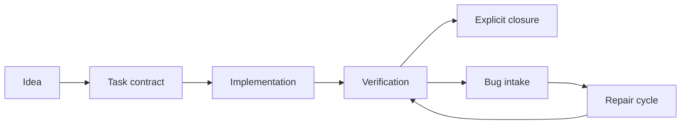

<div align="center">

# Agent Foundry

### Give your coding agent a workflow worth repeating.

**108 skills · 95 command definitions · 3 Unity agent roles · Codex + Claude Code**

[](https://github.com/furkantokkan/agent-foundry/actions/workflows/validate.yml)
[](LICENSE)
[](#install)
[](#install)
[](https://github.com/furkantokkan/agent-foundry/stargazers)

Task contracts, implementation handoffs, bug cycles, design reviews, release checklists, and visual-production workflows.
Built around Unity and game development, with a Blender and CC0 texture-production companion. Includes Clean OOP, Firebase, JavaScript, PBR, UV, bake, and export workflows.

[Get started](#install) · [Browse core skills](docs/CATALOG.md) · [Browse Blender skills](docs/BLENDER_TEXTURES.md) · [Try a workflow](#your-first-workflow) · [Contribute](CONTRIBUTING.md)

</div>

---

## Why Agent Foundry?

An agent can write a feature. Keeping its scope, tests, bug reports, and handoffs connected takes a repeatable process.

Agent Foundry packages the skills and command adapters from my personal Codex and Claude Code setup into a portable, inspectable collection. Start with one task, keep its acceptance criteria in one contract, and bring in the right specialist workflow when you need it.

- **Task-first development.** One `contract.md` owns scope, acceptance criteria, and lifecycle state.
- **Bugs stay attached to their task.** Intake, repair, verification, and closure have separate responsibilities.
- **Unity-aware boundaries.** Confirm the Editor/project connection, declare asset ownership, and hand implementation to verification.
- **Design through release.** GDDs, architecture decisions, playtests, performance reviews, Steam preparation, and release checks.
- **Readable source.** Markdown skills and references you can inspect, adapt, or use individually.

This is a curated workflow library, with personal additions and credited upstream adaptations. It is not a mirror of every installed marketplace plugin. See [sources and licenses](THIRD_PARTY_NOTICES.md).

## Install

Use a recent CLI with plugin marketplace support. Restart your agent session after installation.

### Codex

```bash
codex plugin marketplace add furkantokkan/agent-foundry
codex plugin add agent-foundry@agent-foundry
codex plugin add blender-texture-foundry@agent-foundry
```

Then ask: **“Use the create-task skill to scope a dash ability with a cooldown.”**

### Claude Code

```bash
claude plugin marketplace add furkantokkan/agent-foundry
claude plugin install agent-foundry@agent-foundry
claude plugin install blender-texture-foundry@agent-foundry
```

Then run:

```text
/agent-foundry:create-task "Add a dash ability with a cooldown"
```

### Just want one skill?

Clone the repo, inspect your chosen folder in [`plugins/agent-foundry/skills`](plugins/agent-foundry/skills), and copy the **whole folder**, including its references, to your agent's skill directory. Follow cross-skill dependencies listed in its instructions. The full plugin includes the core task/design workflow dependencies; Editor integrations and optional specialist tools are separate installs.

[Installation details, compatibility, and limitations →](docs/INSTALLATION.md)

## Your first workflow

Try this in a project whose repository instructions and test commands are already defined:

```text
Use create-task to plan a dash ability with a 2-second cooldown.
Use implement-task to implement the resulting task.
Use task-status to inspect its acceptance and verification state.
Use task-bug if the dash still triggers during cooldown.
Use task-done to close the exact task when you accept the result.
```



For Unity, start with `unity-preflight`. Implementation and bug-cycle skills invoke the required readiness checks as part of their own flow.

## Pick your entry point

| What you want to do | Start here |
| --- | --- |
| Find the smallest useful workflow | `adaptive-skills` |
| Scope a feature | `create-task` |
| Implement a scoped task | `implement-task` |
| Report a regression | `task-bug` |
| Resume recorded repairs | `task-cycle` |
| Recover tomorrow's context | `daily-handoff` |
| Check Unity readiness | `unity-preflight` |
| Improve Unity performance | `unity-optimization` |
| Review code and boundaries | `game-code-review`, `clean-oop-architecture` |
| Design a mechanic | `quick-design`, `design-system` |
| Build a Firebase game API | `firebase-game-backend` |
| Plan QA or a release | `qa-plan`, `release-checklist` |
| Prepare a Steam store launch | `steam-store-launch` |
| Find CC0 textures or HDRIs | `texture-discovery`, `ambientcg-assets` |
| Build or prepare a Blender asset | `blender-modeler`, `texture-workflow`, `unity-export` |

**[Explore the core catalog of 92 skills →](docs/CATALOG.md)** · **[Browse Blender & Texture Foundry →](docs/BLENDER_TEXTURES.md)**

## What's in the box?

```text
agent-foundry/
├── plugins/agent-foundry/
│   ├── .codex-plugin/     # Codex manifest
│   ├── .claude-plugin/    # Claude Code manifest
│   ├── skills/            # 92 skills with bundled references
│   ├── commands/          # 7 aliases; avoids duplicate skill names
│   └── agents/            # Implementer, verifier, bugfixer
├── plugins/blender-texture-foundry/
│   ├── skills/            # 16 Blender, PBR and texture-production skills
│   └── commands/          # Blender and texture discovery entry points
├── commands/              # Full archive of 93 command adapters
├── docs/                  # Catalog, setup and export provenance
└── scripts/               # Package validation and export tooling
```

The studio skill also contains role, rule, template, and hook **references**. These are not automatically activated hooks or additional installed agents. Codex loads skills; the three native agent definitions are for Claude Code.

## Project status

**Public release, v0.1.1.** Package structure and manifests are checked automatically. The full collection has not been exercised end to end in every CLI, operating system, Unity project, or Blender configuration. Some detailed studio references assume project-specific templates or tools: adapt them to your repository before running a workflow.

Repository instructions and your agent's tool/approval policies remain authoritative. These Markdown workflows do not enforce a sandbox or grant tools they describe.

## Make it better

Found a broken reference? Have a smaller, clearer workflow? [Open an issue](https://github.com/furkantokkan/agent-foundry/issues) or send a focused PR. See [contribution guidance](CONTRIBUTING.md).

If a workflow saves you time, **star the repo** so other builders can find it. Sharing a concrete before/after example helps even more.

## Credits & license

Maintained by [Furkan Tokkan](https://github.com/furkantokkan). Studio workflows and references include adaptations of [Claude Code Game Studios](https://github.com/Donchitos/Claude-Code-Game-Studios) by Donchitos. Blender & Texture Foundry includes attributed MIT components from [Blender Skills](https://github.com/arjun988/blender-skills) and [dcc-asset-ambientcg](https://github.com/dcc-mcp/dcc-asset-ambientcg). Upstream deserves a star too.

[MIT](LICENSE), with upstream notices preserved in [THIRD_PARTY_NOTICES.md](THIRD_PARTY_NOTICES.md). Unaffiliated with OpenAI, Anthropic, or Unity.
