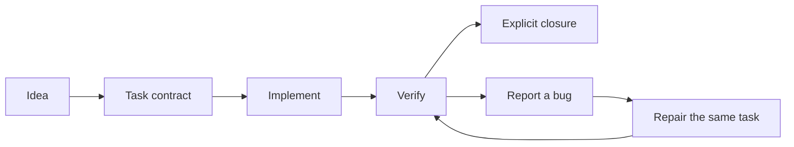

<div align="center">

# Agent Foundry

### Build games with AI. Give every feature a plan, a check, and a next step.

Reusable skills for **Codex** and **Claude Code**, built around **Unity game development**.
From game design and implementation to bug fixes, UI polish, Blender assets, and release prep.

**100+ skills · 3 focused plugins · Plain Markdown · MIT licensed**

[](https://github.com/furkantokkan/agent-foundry/actions/workflows/validate.yml)
[](LICENSE)
[](#codex)
[](#claude-code)

[Get started](#install) · [See a workflow](#your-first-workflow) · [Browse skills](docs/CATALOG.md) · [Blender & AI 3D](#add-blender-and-ai-3d)

</div>

---

## Keep the work connected

The feature is written. You still need to know what was tested, which bugs remain, and where to pick up tomorrow.

Agent Foundry gives your coding agent a repeatable process: scope the work, implement it, verify the result, track regressions, and leave a useful handoff. **One task contract keeps scope, acceptance criteria, and lifecycle together.** Bug records and verification evidence stay linked to that task.

Built from a working game developer's Codex and Claude Code setup, with original skills and credited upstream adaptations. Start with one skill or follow the full workflow.

| When you need to… | Agent Foundry helps you… |
| --- | --- |
| Turn an idea into buildable work | Define scope, constraints, and acceptance criteria before implementation. |
| Work inside Unity | Check the project and Editor connection, declare asset ownership, and plan verification. |
| Fix a regression | Connect the report, repair, and fresh verification to the original task. |
| Polish a menu or combat hit | Apply UI feedback, tweens, hitstop, shake, damage numbers, and SFX guidance. |
| Prepare a 3D asset | Follow Blender modeling, PBR, UV, bake, and export workflows. |
| Resume tomorrow or prepare a release | Recover the next step from a handoff, or work through QA and release checks. |

Every skill is readable Markdown. Inspect the instructions, adapt them to your repository, and keep the parts that fit.

## Install

Choose your agent. These two commands install the **93-skill core plugin**. Use a CLI version with plugin marketplace support, then restart your agent session.

### Codex

```bash
codex plugin marketplace add furkantokkan/agent-foundry
codex plugin add agent-foundry@agent-foundry
```

Then ask:

```text
Use create-task to plan a dash ability with a 2-second cooldown.
Keep the existing movement controls and define how the cooldown will be verified.
```

### Claude Code

```bash
claude plugin marketplace add furkantokkan/agent-foundry
claude plugin install agent-foundry@agent-foundry
```

Then run:

```text
/agent-foundry:create-task Add a dash ability with a 2-second cooldown.
```

**Prefer one skill?** Copy its entire folder, including references, from [`plugins/agent-foundry/skills`](plugins/agent-foundry/skills) into `~/.codex/skills/` or `~/.claude/skills/`. Check its cross-skill dependencies and restart the session.

[Installation details and compatibility →](docs/INSTALLATION.md)

## Your first workflow

Use a project with repository instructions and test commands already defined. For Unity, begin with `unity-preflight` to check the target project and Editor.

The dash prompt above creates `production/tasks/<TASK-ID>/contract.md`. Review its scope and acceptance criteria, then replace `<TASK-ID>` below with the generated ID. **Send each prompt separately as the work progresses.**

| Step | Prompt |
| --- | --- |
| Implement the plan | `Use implement-task <TASK-ID>.` |
| Inspect the result | `Use task-status <TASK-ID> to show acceptance criteria, verification evidence, and the next step.` |
| Report a regression, if needed | `Use task-bug <TASK-ID>: rapidly pressing dash lets me dash again before the cooldown ends.` |
| Close when the required criteria pass | `Use task-done <TASK-ID> --strict.` |

In Claude Code, use the same skill names with the `/agent-foundry:` prefix. Bug intake routes reports into the original task; `task-cycle` resumes recorded repairs.



Task creation plans the feature. Implementation and verification follow. Closure remains an explicit decision.

## Find your next skill

| Goal | Start with |
| --- | --- |
| Choose a workflow for the current job | `adaptive-skills` |
| Design a mechanic or progression system | `game-design-studio`, `quick-design`, `design-system` |
| Implement or review Unity code | `unity-game-dev`, `game-code-review` |
| Diagnose CPU, GPU, or GC problems | `unity-optimization` |
| Polish menus, HUDs, or combat feedback | `game-feel-polish` |
| Build a Firebase game API or JavaScript tool | `firebase-game-backend`, `javascript-game-tools` |
| Review architecture and dependency boundaries | `clean-oop-architecture` |
| Hand off today's work | `daily-handoff` |
| Plan QA, a release, or a Steam launch | `qa-plan`, `release-checklist`, `steam-store-launch` |

**[Browse all 93 core skills →](docs/CATALOG.md)**

### Try Liquid UI feedback in Unity

The core plugin includes `game-feel-polish`: animated buttons, staggered menus, counters, lag bars, toasts, tooltips, and audiovisual feedback, with Liquid UI guidance adapted to Unity.

```text
Use game-feel-polish to add hover, press, and entrance feedback to this Unity menu.
Preserve keyboard/gamepad navigation and reduced-motion support.
```

Read the [Unity system guide](plugins/agent-foundry/skills/game-feel-polish/references/unity-port.md) and [UI Toolkit guide](plugins/agent-foundry/skills/game-feel-polish/references/unity-ui-toolkit.md). New screen-space UI uses UI Toolkit; existing UGUI projects keep their stack. This is implementation guidance; art, audio, and a compiled Unity package are not bundled.

## Add Blender and AI 3D

Install the companions when your work moves into asset production.

| Plugin | Skills | What it covers |
| --- | ---: | --- |
| **[Agent Foundry](docs/CATALOG.md)** | 93 | Task workflows, Unity, game design, Firebase, code review, QA, and releases. |
| **[Blender & Texture Foundry](docs/BLENDER_TEXTURES.md)** | 16 | Modeling, CC0 textures, PBR materials, UVs, baking, lighting, and Unity export. |
| **[AI 3D Foundry](docs/AI_3D.md)** | 3 | Modeling from references, image-to-textured-mesh generation, and assembly of generated assets in Blender. |

<details>
<summary><strong>Install the optional companions</strong></summary>

After adding the marketplace above, choose either or both plugins.

**Codex**

```bash
codex plugin add blender-texture-foundry@agent-foundry
codex plugin add ai-3d-foundry@agent-foundry
```

**Claude Code**

```bash
claude plugin install blender-texture-foundry@agent-foundry
claude plugin install ai-3d-foundry@agent-foundry
```

Restart your agent session. Blender, compatible tool connections, and generation-provider dependencies are separate installs. Check the [Blender requirements](docs/BLENDER_TEXTURES.md) and [AI 3D requirements](docs/AI_3D.md).

</details>

## What to expect

Agent Foundry runs through your agent's available tools and respects your repository instructions and approval policies.

- **Shared skill sources.** Both agents use the same Markdown. Claude Code also loads three native Unity roles: implementer, verifier, and bugfixer. Codex uses its host’s collaboration tools.
- **Bring your project tools.** Unity, Blender, Editor connections, external services, and credentials are not included. Studio templates and hook examples are references to adapt to your project.
- **Automated package checks.** CI validates inventory, manifests, bundled references, and export hashes. The full collection has not been tested end to end in every CLI, operating system, Unity project, or Blender setup.

See [verification scope](docs/INSTALLATION.md#verification-scope). Check the package locally with `python scripts/validate.py`.

## Help shape the next workflow

A useful contribution can be small: clarify an instruction, report a broken reference, or share a reproducible workflow with its expected and actual result.

[Open an issue](https://github.com/furkantokkan/agent-foundry/issues) · [Contribution guide](CONTRIBUTING.md)

**If Agent Foundry earns a place in your development setup, give it a star.** Share the skill that helped and what you built with it so the next developer knows where to start.

## Credits & license

Maintained by [Furkan Tokkan](https://github.com/furkantokkan). Released under the [MIT License](LICENSE).

Built with original workflows and adaptations from:

- [Claude Code Game Studios](https://github.com/Donchitos/Claude-Code-Game-Studios) by Donchitos — studio workflows and references.
- [Liquid UI Kit](https://github.com/Miisan-png/godot-liquid-ui) by Miisan — the foundation for the Unity game-feel guidance.
- [Blender Skills](https://github.com/arjun988/blender-skills), [dcc-asset-ambientcg](https://github.com/dcc-mcp/dcc-asset-ambientcg), [Blender SuperSkill](https://github.com/powerhouse90/Blender-Superskill), [Alpha3D scene generation](https://github.com/ig-shadow-walker/BlenderXAlpha-3DGenSkill), and [skill-clusters](https://github.com/Sheshiyer/skill-clusters) — Blender and AI 3D components.

See [THIRD_PARTY_NOTICES.md](THIRD_PARTY_NOTICES.md) for source details and preserved notices. Give the upstream projects a star too.

Unaffiliated with OpenAI, Anthropic, or Unity.
