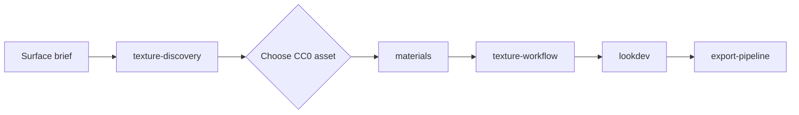

# Blender & Texture Foundry

`blender-texture-foundry` is the visual-production companion to the core Agent
Foundry plugin. It contains 16 focused skills for Blender work and CC0 texture
research.

## Install

```bash
codex plugin marketplace add furkantokkan/agent-foundry
codex plugin add blender-texture-foundry@agent-foundry
```

```bash
claude plugin marketplace add furkantokkan/agent-foundry
claude plugin install blender-texture-foundry@agent-foundry
```

Restart the agent session after installation.

## Start with the job, not the tool

| Job | Skill |
| --- | --- |
| Find a legal texture or HDRI | `texture-discovery` |
| Search/download an ambientCG asset | `ambientcg-assets` |
| Block out or clean a mesh | `blender-modeler` |
| Build a hard-surface prop | `hard-surface` |
| Create PBR materials | `materials` |
| UV, bake, atlas, or optimize texture memory | `texture-workflow`, `uv-workflow` |
| Establish a final surface/lighting look | `lookdev`, `lighting`, `camera-cinematography` |
| Build procedural geometry | `geometry-nodes` |
| Render or export to Unity | `rendering`, `export-pipeline`, `unity-export` |

The plugin can guide a Blender task, but it does not install Blender, a Blender
MCP bridge, renderer add-ons, or external asset accounts. Verify the actual
tools available in the active session before attempting a scene mutation.

## Texture workflow



Use 1K–2K maps for most game assets. Select `nor_gl` normals for Blender, keep
roughness/metallic/AO maps in Non-Color space, and document the source URL and
license with the asset. Use 4K only when the asset has enough screen coverage
to earn the memory cost.

## Included skills

- `texture-discovery` is original Agent Foundry guidance for comparing Poly
  Haven and ambientCG.
- `ambientcg-assets` searches and downloads CC0 archives from the official
  ambientCG API. It requires Python 3.10+ and `dcc-mcp-core`.
- The remaining fourteen skills cover modeling, materials, UVs, texture
  production, look development, lighting, camera, rendering, procedural work,
  optimization, export, Unity delivery, and hand-painted styling.

Every source is inspectable Markdown. See [third-party notices](../THIRD_PARTY_NOTICES.md)
for upstream attribution and licensing.
